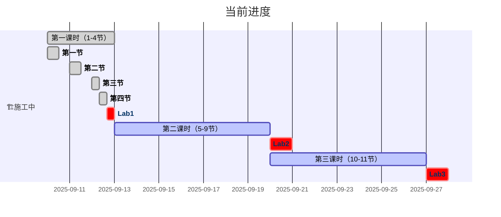

# 前言

> 入门真的很简单，但是想要提高水平真的只有多拍这一条路

有空的时候呢，可以选择看一看，也不用花很久，就当是消遣了

```mermaid
gantt
  title 当前进度
  section 🏗️施工中
      第一课时（1-4节） :done, des0, 2025-09-10, 3d
          第一节: done, a0, 2025-09-10, 12h
          第二节: done, a1, 2025-09-11, 12h
          第三节: done, a2, 2025-09-12, 8h
          第四节: done, a3, after a2, 8h
      Lab1  :crit, des1, after a3, 8h
      第二课时（5-9节） : active, des2, after des0, 7d
      Lab2  :crit, des3, after des2, 1d
      第三课时（10-11节）: active, des4, after des2, 7d
      Lab3  :crit, des5, after des4, 1d
  click a0 href "https://dvvvvviii.github.io/photographyGuideline/#/./srcPages/aboutStyle"
  click a1 href "https://dvvvvviii.github.io/photographyGuideline/#/./srcPages/light"
  click a2 href "https://dvvvvviii.github.io/photographyGuideline/#/./srcPages/cameraBody"
  click a3 href "https://dvvvvviii.github.io/photographyGuideline/#/./srcPages/cameraLens"
  click des1 href "https://dvvvvviii.github.io/photographyGuideline/#/./srcPages/Lab1"
  click b0 href "https://dvvvvviii.github.io/photographyGuideline/#/./srcPages/exposure"
  click b1 href "https://dvvvvviii.github.io/photographyGuideline/#/./srcPages/focalLengthAndAperture"
  click b2 href "https://dvvvvviii.github.io/photographyGuideline/#/./srcPages/color"
  click b3 href "https://dvvvvviii.github.io/photographyGuideline/#/./srcPages/colorTempAndWB"
  click b4 href "https://dvvvvviii.github.io/photographyGuideline/#/./srcPages/filter"
  click des3 href "https://dvvvvviii.github.io/photographyGuideline/#/./srcPages/Lab2"
  click c0 href "https://dvvvvviii.github.io/photographyGuideline/#/./srcPages/postProcessing"
  click c1 href "https://dvvvvviii.github.io/photographyGuideline/#/./srcPages/composition"
  click des5 href "https://dvvvvviii.github.io/photographyGuideline/#/./srcPages/Lab3"
```

> Log:
>
> - 9月13日做完了第一课时

