# 第一节  关于照片的类型和风格

---------------------------------------
> 按我自己浅薄的经验来分类，除了广告拍摄的静物之类的，日常摄影大致可以分为风光、人像、人文三类。
>
> 但是呢，你的需求是在这几类之外的延展，更偏向于新闻或者记录风格，可能会用于内部媒体的宣传。
>
> 这一节没有干货，主要是给你大致介绍一下以上的几种摄影类型，以及不同的快门工拍摄同一类型照片时用的风格。

---------------------------------------

在我们区分不同类型的照片时，除了用眼睛“这一眼看上去就是XXX”的判断标准之外，还可以定性地判断，这个判断的标准就是拍摄的主体

--------------------------------------------------

### 1.1  风光摄影

> 大自然的搬运工，主体是景或物

顾名思义，风光摄影就是拍风景，可以是山，可以是水，也可以是凌晨爬起来看的太阳。

那这个时候有人出现抢镜头怎么办？

没有关系，人在这里不是主体，只要不是占比太大，完全可以当作点缀用。

|                     描述                      |                             图片                             |
| :-------------------------------------------: | :----------------------------------------------------------: |
| 这一张就是旷野的风光，虽然后面那个云是P上去的 |                             |
|    景大于人，图片的重心在于传达景色的美好     | 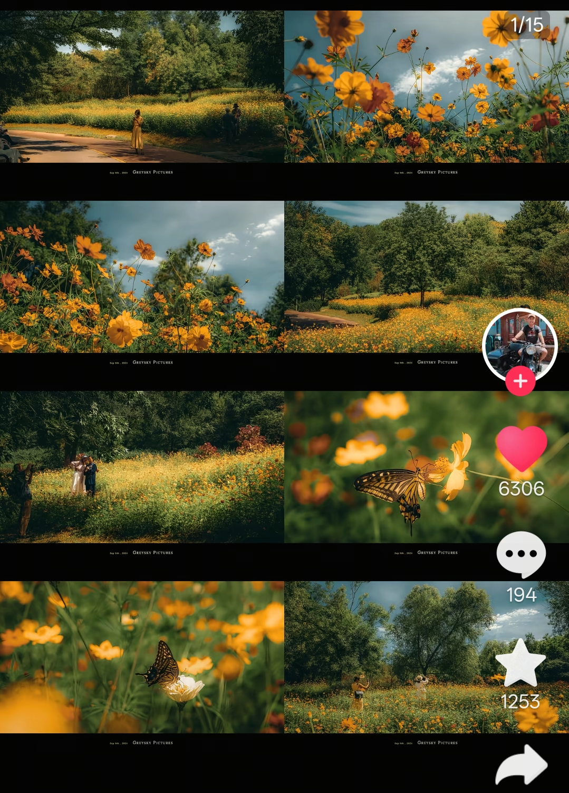 |
|  风光也不仅仅是单指自然风光，人造的景也是景   | 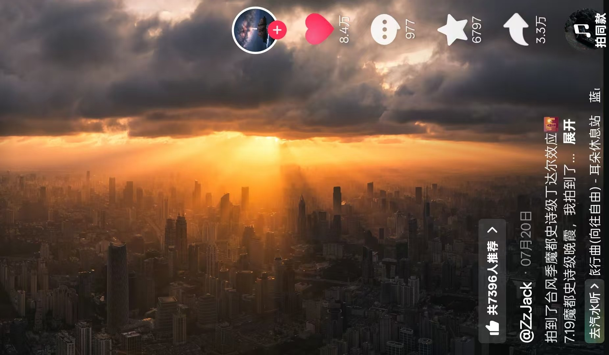 |

> 呐，你应该能看出来了，不同的人即使同样去拍风景，拍出的照片风格差别也很大，这里仅需了解，至于为什么会有这样的差别，差异性从哪里来我们后面再说。

------------------------------------------------------------

### 1.2  人像摄影

> 拍好点成为夸夸群群主，主体是一到两个人

人是比景更难拍的（自我感觉），因为拍人的时候不单单在是在拍人，同时会拍到人的情绪、感觉和表达，这种多维的状态让人像摄影有一种特殊的魅力，总会让人期待还能拍到什么。

一般而言，如果你的拍摄对象不是一个很专业的模特，或者有面对镜头的超绝天赋，结果不出意外会变成平平无奇的游客照。你大概会有90%的时间在指导模特“头低一点、笑开一点、眼神再迷离一点”，还有10%的时间在擦额头上的汗。

|                          描述                          |                             图片                             |
| :----------------------------------------------------: | :----------------------------------------------------------: |
| 构图什么的我们不在这里说，就是单纯欣赏一下其他人的作品 | 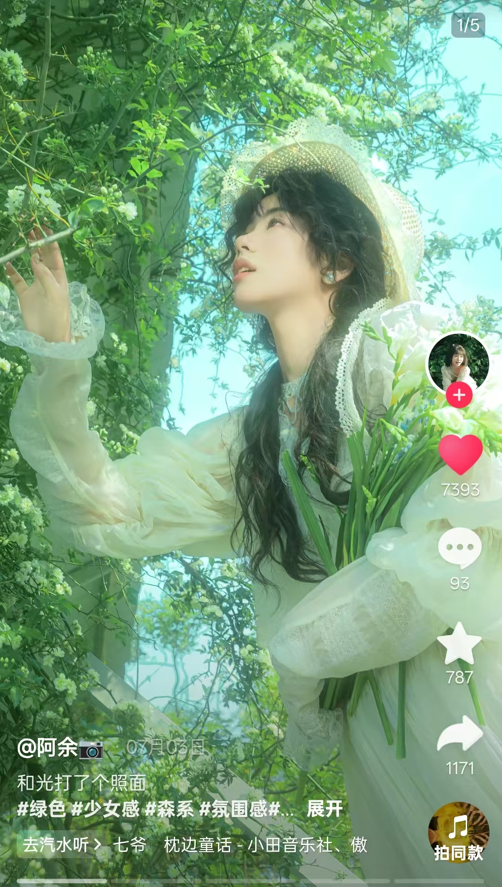 |
|  可以和上面那张做对比，这两张照片分别带给你了什么感觉  | 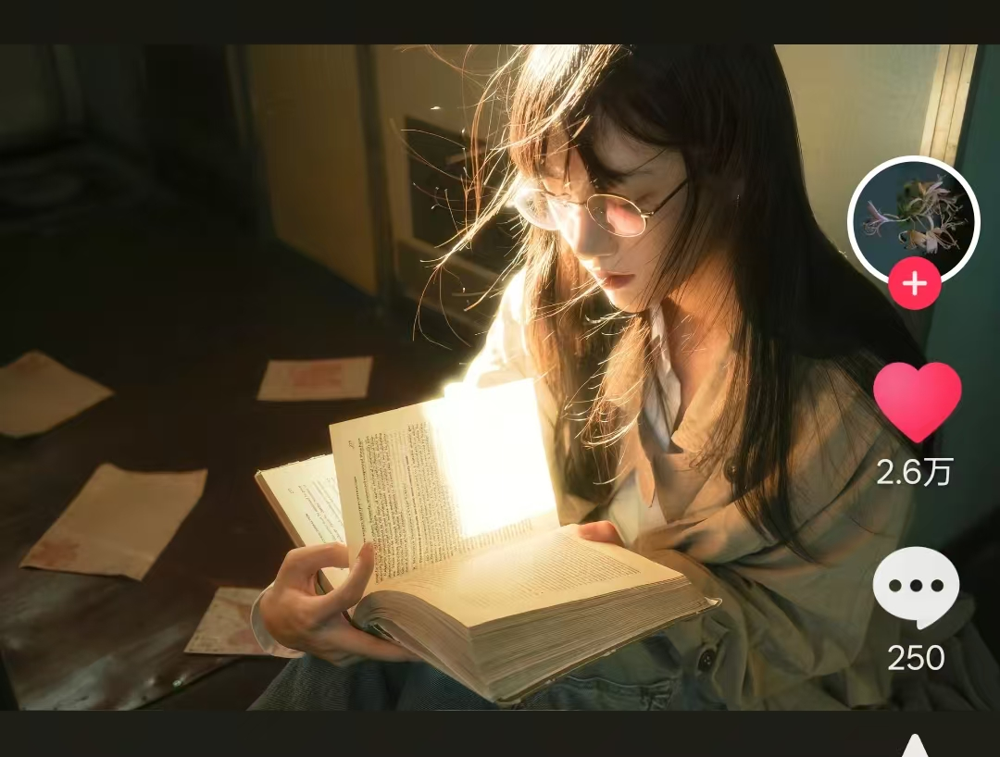 |
|                  王家卫风格的男性人像                  | 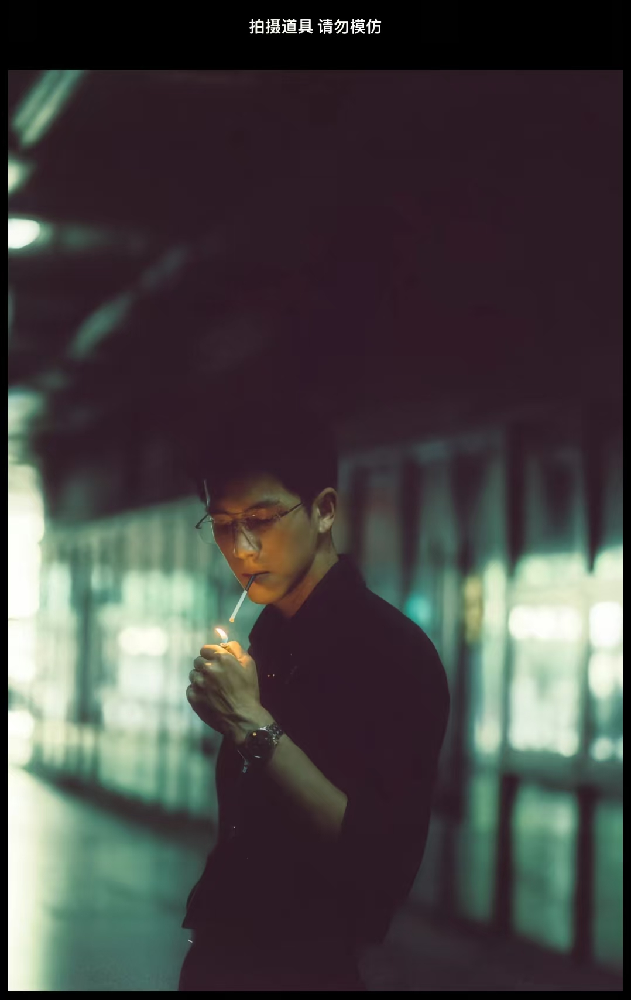 |
|       2019年索尼世界摄影大赛公开赛肖像组入围作品       | 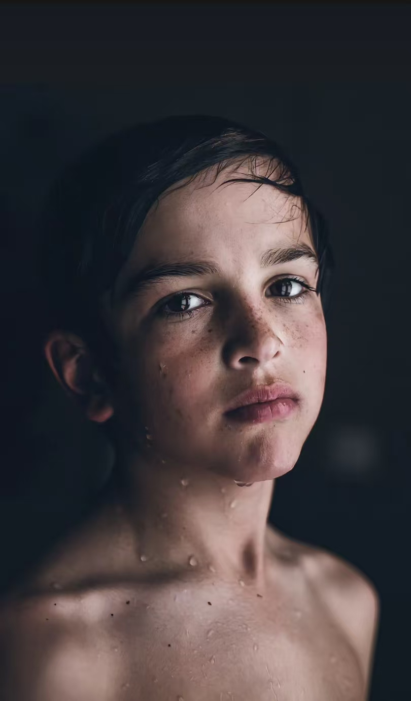 |

> 作为摄影师，如果让你选一张最喜欢的去拍，你会选哪一张？
>
> 作为模特，如果再让你选一张最喜欢的去拍，你会选哪一张？

----------------------------

### 1.3  人文摄影

> 在人群里举个相机，看起来很猥琐地在拍什么东西的人，八成是在拍人文照片，主体是(人+环境)

在人文摄影里，人与景的比重一下子就没那么头重脚轻了，基本上是和谐地交融在了一起。

这也是我最喜欢的类型，因为需要以第三人称的视角来提供画面，大多数人文摄影都是追求人在当下环境里的状态，信息量非常足，好的照片能表达出很多内容。

|                       描述                       |                             图片                             |
| :----------------------------------------------: | :----------------------------------------------------------: |
| 夜市里的摊主、顾客与小女孩，她们什么时候可以休息 | 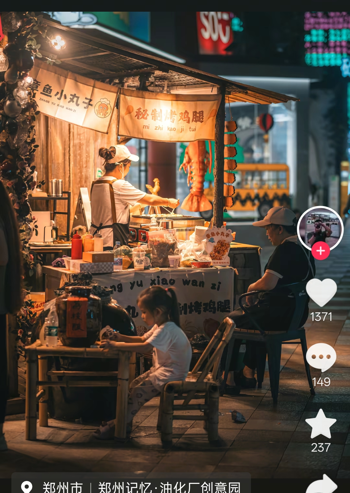 |
|        他们看上去好像一对情侣，玩得很开心        | 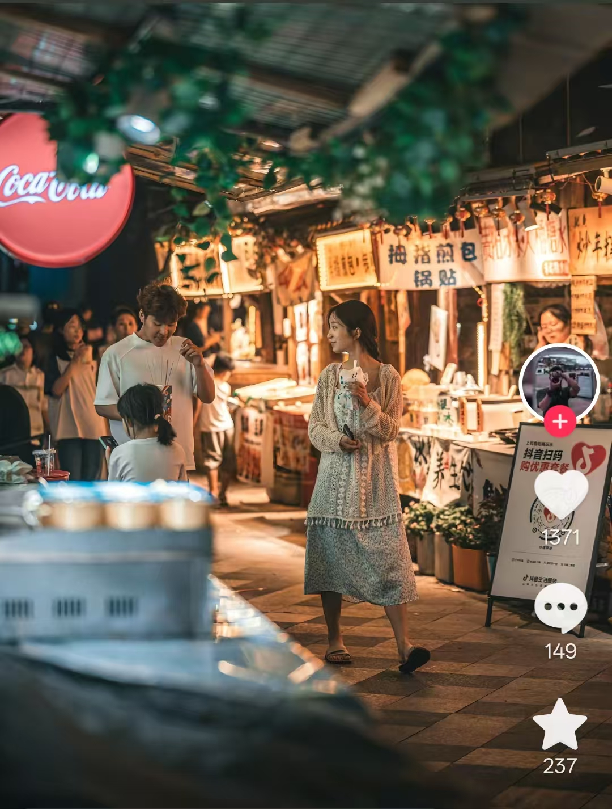 |
|               属于这个人的生活片段               | 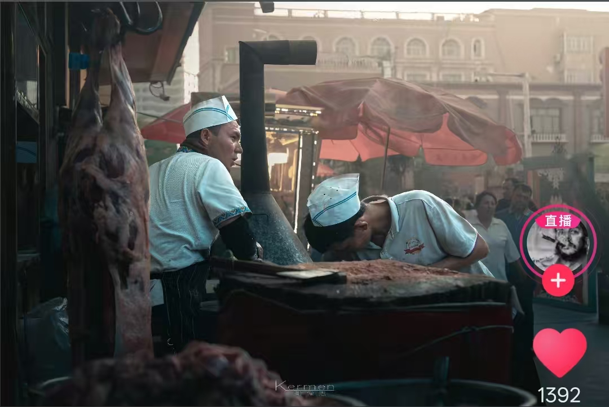 |
|           气氛很好，演奏的人也乐在其中           | 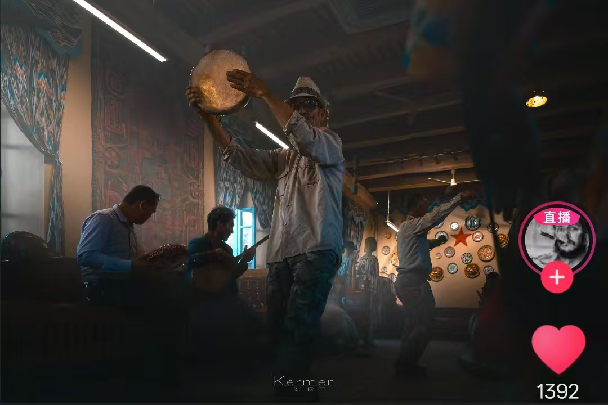 |
|    演奏完了甚至可以抽根烟，他的日常就是这样吧    | 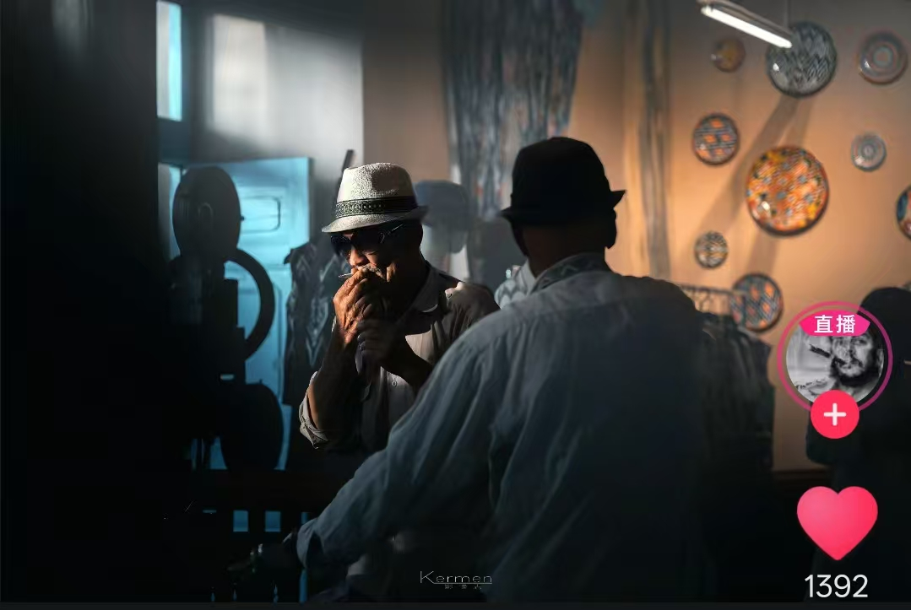 |

> 与之前两个类别不同的是，在人文摄影中，人与环境需要互相服务对方，相辅相成，缺一不可。

-------------------------------------

### 1.4  调研跟拍、会议记录

> 按我的理解这里其实是摆拍多一些，主体往往是(一群人)

在工作中，尤其是宣传工作中，往往需要很多照片作为素材，当你不幸被选为那个负责记录素材的人，就需要小小地学一点技巧，让领导满意，不过这一块不属于我擅长的区域。但后续的内容是通用的，一样可以用来在这里提高工作效率。

|                             描述                             |                             图片                             |
| :----------------------------------------------------------: | :----------------------------------------------------------: |
| 去年的年度照片，抓拍时机以及良好的机位让他成就了这么经典的照片 | 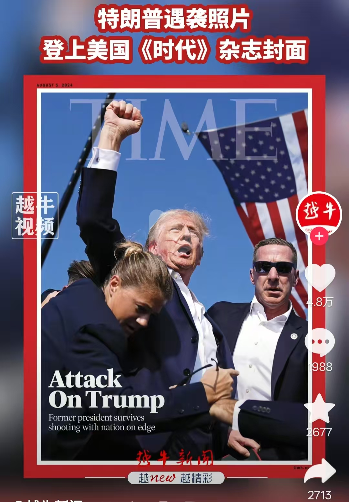  |
| 当有一群人的活动要记录时，把最主要的领导放在最中间总是没错的 | 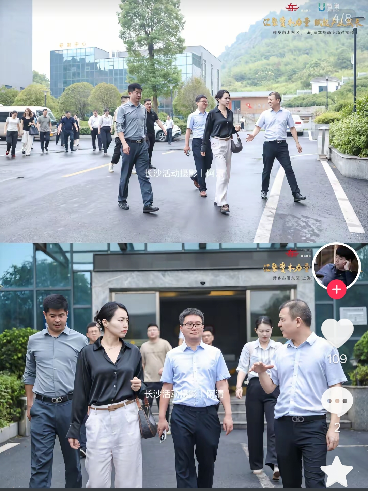  |
| 因为摆拍（非贬义）成分更多，所以拍摄主体的表情、动作和当前活动想传达的信息匹配时拍摄，比如这里他拿着玉米那么高兴，整体基调就是积极向上的，不那么严肃也能突出他亲民不是。 | 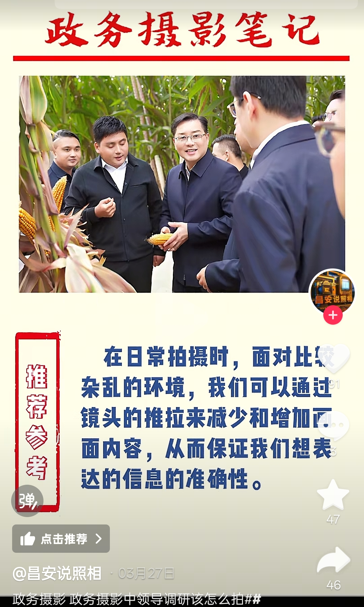 |
| 虽然找的都是政务类的跟拍，不过都有可取之处，我冥冥中感觉你们领导要的可能也是这个风格 | 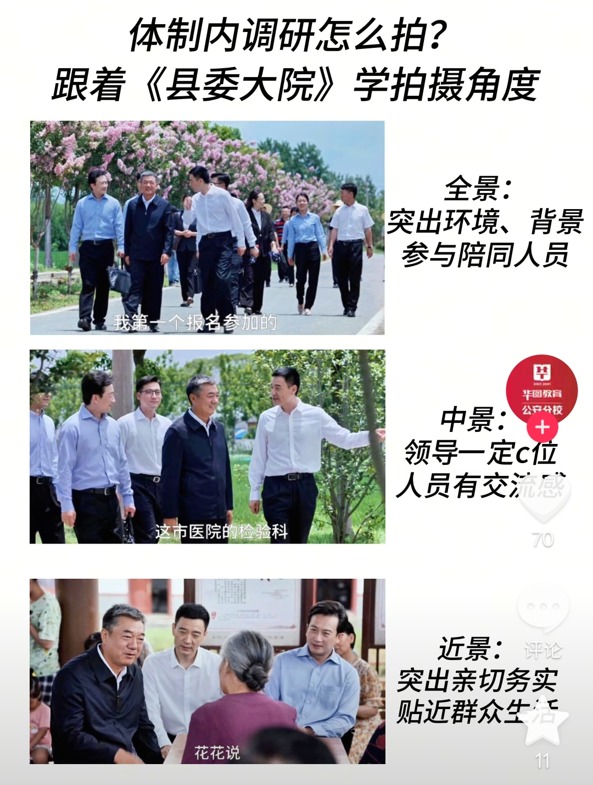  |

> 会议或调研、出访中，给大领导留个C位，让照片内容可以看得出主题或者态度（比如表彰大会就拍他们笑，批评大会就拍他们皱紧眉头）

--------------------------------

以上就是你近期可能会接触到的摄影类别，下一节我会说点干货的前置内容，希望能帮助你了解拍照时到底有什么影响了你的成片质量。