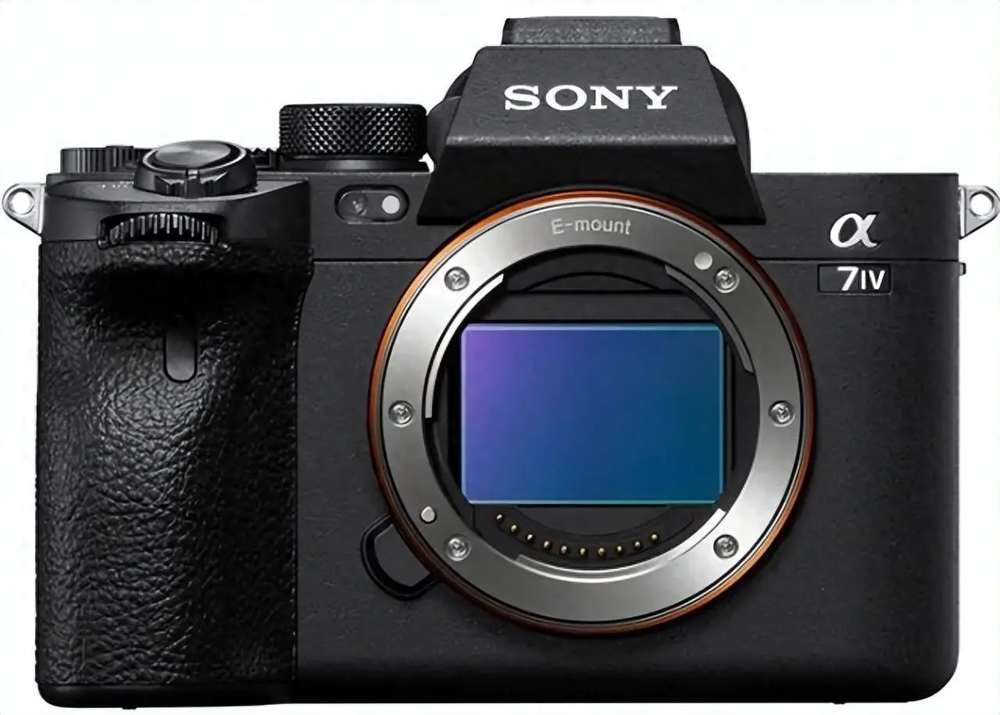

# 第三节  认识相机-机身篇

### 3.1  相机之间的差异

大家经常说相机的时候往往会带着品牌和型号，但是如果不直接接触的话，可能会误认为品牌之间有很大差距。

我一点也不反对，不同牌子之间的相机确实是有差异的，但与其说是有差距，不如说是各有所长。

真正让你可以直观感受到差距的，是相机传感器——也就是常说的CMOS大小。

那么这个传感器在哪儿呢？

拧开相机保护盖，在没安装镜头之前，你能看到这样一个东西：

> 这个中间反着光的彩色矩形就是CMOS，相机的感光单元。

我刚才说CMOS的大小可以让你感受到相机的差距，是因为它直接决定了你能捕捉到多少光线，同样照过来的光，最后都会落在传感器上。

这时候传感器越大，那么接收到的光就越多，呈现更细腻的画质、更高的感光度、更少的噪点和更广的动态范围（是不是有些术语没搞明白？没关系这不重要，现在我们只是了解一下它就是大点更好）。

因此，用CMOS大小区分相机的质量一般是没错的。

下面就是部分相机的CMOS大小对比（画幅大小指的就是CMOS大小），从小到大，价格越来越高，只能说有钱人的世界真不一样👍

-----------------------------------

### 3.2  全画幅

我们就不说其他画幅了，主要讲讲全画幅和半画幅，因为这就是主流的两种画幅。

从上面那个图片看，全画幅比半画幅（APS-C画幅）的CMOS要大一圈，所以显然一般情况下全画幅就是会比半画幅的成像质量更好，价格也更贵。

全画幅的优势：

- **画质碾压**：大底带来丰富的细节还原，尤其在风光、人像摄影中，色彩过渡自然，暗部噪点控制优秀。
- **虚化无敌**：相同光圈下，全画幅能实现更浅的景深，轻松拍出背景虚化的 “奶油感”，突出主体。（后面会讲光圈和景深的作用）
- **高感王者**：暗光环境下，高 ISO 设置仍能保持画面纯净，适合室内、夜景等复杂光线场景。（后面会在曝光一节讲ISO）

缺点：

- **预算门槛高**：机身和镜头价格普遍较高，入门级全画幅套机万元起步，后续镜头升级成本也较大。（相当相当贵）
- **便携性短板**：机身和镜头体积较大、重量较重，长时间外拍易疲劳，不适合轻量化需求用户。（确实很重）

-----------------------------------

### 3.3  半画幅（APS-C画幅）

全画幅那么好，但依然有半画幅的生存空间，甚至半画幅的持有率还高于全画幅，那肯定是有一定原因在的。

除了全画幅本身的短板，半画幅也有长处：

- **亲民价格**：机身和镜头性价比高，入门套机相对便宜，入门机身仅需3000-5000元，适合预算有限的新手试水。
- **轻便易携**：机身小巧轻便，搭配饼干头或变焦镜头，适合日常扫街、旅行跟拍，轻松记录生活。
- **镜头生态灵活**：既有专用的半画幅镜头，也能兼容全画幅镜头（需考虑等效焦距），选择多样。

但缺点也很明显：

- **画质上限低**：高感光度下噪点较明显，动态范围较窄，大光比场景中高光和阴影细节保留较少。
- **虚化能力有限**：相同光圈下景深更深，背景虚化效果较弱，难以实现全画幅般的极致虚化。

我自己用的就是索尼的α6700，属于半画幅相机，但相对来说成像表现还可以，半画幅的镜头对比全画幅也便宜很多，对预算不充足的人很友好。

> Q: 那么除了画质以外，全画幅和半画幅就没有其他区别了吗？
>
> A: 有的兄弟，有的。因为半画幅的CMOS小，视角范围也小，那么在镜头焦距和拍摄距离一样的时候，半画幅拍到的画面就只有全画幅的一部分，感觉上就像是裁切了一部分。
>
> Q: 那感觉缺陷很大……
>
> A: 也不尽然，视角范围小了，与此同时，如果想拍更远的东西，你会发现，半画幅相当于延长了焦距，反而拍的更清楚😜，有失也有得。

> 左图： 半画幅    右图：全画幅

除非是很严格地去对比，不然在多数情况下，两者的差距并没有大到特别离谱的地步，如果是自己想入坑，量力而行用半画幅入门是绰绰有余的。

😇要记得保护相机的CMOS

😥错误示范：

-----------------------------------

### 3.4  这些按钮都是用来干嘛的

枯燥的理论内容到此为止，接下来就是说一下怎么开始拍，虽然我觉得你自己随便摸索一下，几分钟就ok了，但按照惯例还是说一下。

第一步其实是如何安装镜头：但聪明的你不需要我教这个，别忘了拍照前卸下镜头盖就行

#### 3.4.1 调节档位

一般来说，除了厂家提供的P档、A档、M档、S档较为常用外，最重要的是Auto档。

那这个档位是做什么的呢？有什么含义呢？

其实它代表着你是否要选择机器自动曝光或者哪种曝光优先模式，我知道这会儿听这个绝对是云里雾里的，所以不用管，你把他的Auto档（佳能系列机器可能是这个绿色的小框）搬到和那个指针对齐就行。

这样一来你只负责按快门就行，我们第一个Lab之前的目标就是能按快门拍出照片来。毕竟也不考试，主打一个能用就行。

#### 3.4.2 检查储存卡

众所周知，🌞太阳一定要会发光，🍚饭一定要能吃。

所以，拍照需要一个储存卡，不然幸苦半天，什么都没有留下，竹篮打水一场空。

储存卡的类别可以分为SD卡、TF（microSD）卡、XQD卡、CFexpress卡等类型，**⚠️不用记！**我们这里只用SD卡就行。

> 就是这样一个卡

确保里面有卡就行。没有就问问领导怎么办的事，这点事都做不好😡（误

#### 3.4.3 了解按键（以佳能R8为例）

其他的先不用了解，知道回看和删除暂时就够用了。

如果你感觉对焦有点麻烦，就按住AF-on那个按键，会一直保持自动对焦。

回看时可以配合拨轮转动，快速浏览历史照片。

> 现在直接咔嚓咔嚓就行，虽然照片可能会糊，但是没关系，以后就不会了。
